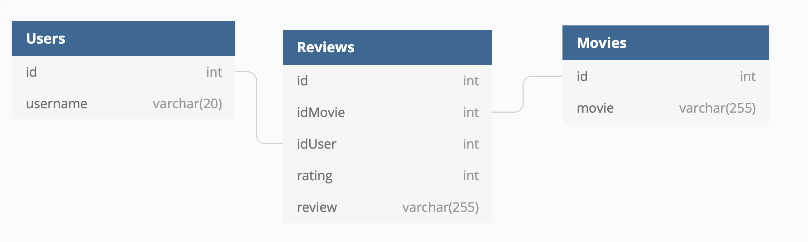

# DebtGes Intern Software Engineer - PHP Challenge

Welcome to the PHP challenge!

# Background

Hello there. Thanks for helping with that Patterson issue, that was very helpful!

Given your outstanding performance lately we have decided to come to you to work in most important project we have at the moment. Let me give you the details: our company has a branch of business where we are (trying to become) the next Imdb 2.0. We have a storage of users, movies and their reviews, and currently we would like to release an API so that anyone could access our data.

Let me give you a summary of what you should do.

# Index

- Data Structure
- Data Storage
- API requirements
- API endpoints
- Tips
- Deadline
- How to deliver
- Grading

# Data Structure

You will work with the following data structure:

You only have one main entity, which is **Reviews**. Each **Review** should have the following fields:

1. movie - the movie associated with the review
2. user - the username that is giving the review
3. rating - the rating that the user gives to the review. One of the following: {1,2,3,4,5}
4. review - The text review of the user.

# Data Storage

You should be able to storage your data while the program is running. For that you are going to use [SQLite](https://www.sqlitetutorial.net/what-is-sqlite/) with PHP's Laravel Framework. You can find a [video tutorial here](https://www.youtube.com/watch?v=kWmnQvznkUI) of how you can do that, and if that guide isn't enough you can also find more guides elsewhere.

For those you don't know how to work with SQLite, don't fright! Essentially SQLlite allows you to work with a database as a single file with .db extension, Instead of setting up an actual database to interact with it.

# API requirements

List of functionalities:

- Create new user/movie/review
- Delete user/movie/review
- Get all users/movies/reviews
- Get specific user/movie/review
- Get average rating of movie
- Get average rating of user

# API endpoints

Below you can find examples of how you would perform calls to your api. I'm using Curl to make the request in these examples but if you don't know how to work with it don't worry. You can use postman tools.

### Create new user

**inputs**: name of user

**constraints** : None

curl -X POST http://localhost:<Port>/insertUser --data '{"user":"John"}'

---> {'user':'John',option:'create','status':'success'}

### Delete user

**inputs**: id of user

**constraints** : Must exist in database

curl -X POST http://localhost:<Port>/deleteUser --data '{"userId":<userId>}'

---> {'userId':userId, 'username':<username> , 'option':'delete','status:'<success/error>'}

> Procedure for creating and deleting users is same for creating movies

### Create Review

**inputs** : userId, movieId, text of review, rating of review. 

**constraints**: movieId and userId must exist in the database.

curl -X POST http://localhost:<Port>/createReview --data '{"userId":<userId>, "movieId":<movieId>, "review":<review>,"rating":<rating>}'

---> response = {'username':<username>,'userId':<userId>,'movieId':<movieId>,'movie':<movie>, 'review':<review>, 'rating':<rating>,'option':'create','status':'success'}

### Delete review

**inputs** : reviewId 

**constraints**: reviewId must exit in the database

curl -X POST http://localhost:<Port>/deleteReview --data '{"reviewId":<reviewId>}'

---> response = {'username':<username>,'userId':<userId>,'movieId':<movieId>,'movie':<movie>, 'review':<review>, 'rating':<rating>,'option':'delete','status':'success/error'}

### Get all users

**inputs**: None

**constraints** : None

curl -X GET http://localhost:<Port>/getAllUsers

---> response = {<userId>:<userName>, <userId>:<userName>,...}

> Proccedure is same for movies and reviews

### Get Specific user

curl -X GET http://localhost:<Port>/getuser --data '{"userId":<userId>}'

---> response = {'userId':<userId>,'username':<username>,'option':'get','status':'success'}

> Proccedure is similar for movies and reviews.

### Get Average rating of movie

This is optional. You will have to figure out by yourself how you should do this.

### Get Average rating of user

This is optional. You will have to figure out by yourself how you should do this.

# Tips

## Test Cases

Create test cases to make sure your app is behaving correctly. E.g. insert users, movies and reviews, then get the reviews from a certain movie and check if you get the expected result. 

# Deadline

You have until Friday 05th February at 20:00H to deliver your project.

# How to deliver

Create a github repository with your project and work there. As soon as you have a repo ready send an email to the organizer titled "REPO FOR PHP CHALLENGE - <FirstName LastName>" with the link in the body.

# Grading

As soon as the deadline ends, Our team will fetch your project from the github repository using the last commit made before the deadline.

We will evaluate the following skills:

- Code organization
- Code readibility
